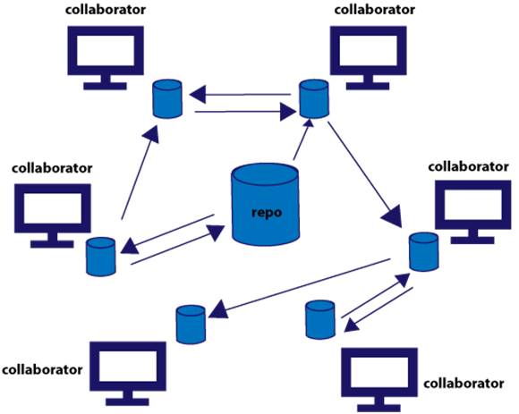

# Beginner's Git and Github Tutorial

<details>
<summary>Table of Contents</summary>
<ol>
    <li><a href="#git">Git</a> 
    <ol>
        <li><a href="#defining-git">Defining Git</a> </li>
        <li><a href="#configuring-git">Configuring Git</a> </li>
        <li><a href="#creating-a-git-repository">Creating a Git Repository</a> </li>
        <li><a href="#git-commits">Git Commits</a> </li>
        <li><a href="#git-workflow">Git Workflow</a> </li>
    </ol>
    </li>
    <li><a href="#github">Github</a>
    <ol>
        <li><a href="#connecting-repository">Connecting Repository</a> </li>
        <li><a href="#pushing-changes">Pushing Changes</a> </li>
        <li><a href="#pulling-changes">Pulling Changes</a> </li>
    </ol>
    </li>

</ol>

</details>

## Git

### Defining Git

According to its <a href="https://git-scm.com/"><u><em>creators</em></u></a>, **Git** is a _free and open-source_ <a href="#distributed-version-control-system">**_distributed version control system_** </a>designed to handle everything from small to very large projects with speed and efficiency.

##### Version Control System

A version control system is a tool that keeps track of every modification inside a codebase through a database. If a mistake is made, developers can turn back the clock and compare earlier versions of the code to help fix the mistake while minimizing disruption.

**Use these images for your imagination:**


<p align="center"><small>Flip Book</small>

</p>


<p align="center"><small>Snapshots</small></p>

##### Distributed Version Control System

DVCS is a type of version control where the complete codebase — including its full version history — is mirrored on every developer's computer.


<p align="center"><small>Diagram of a Distributed Version Control System</small></p>

### Configuring Git

Git needs the information of the developer that's using it to identify who are the people making the changes.

Follow these commands to configure git:

1. Set-up your name that will identify who are you inside the commits.
    ```bash
    git config --global user.name "<name>"
    ```
    <small>Wrap the username of your choice inside a string literal.</small>
2. Set-up your email. Ensure that you are using the same email as your github account so you can work with your github repositories inside your machine.
    ```bash
    git config --global user.email "<email>"
    ```
3. Set-up your default git editor by following the commands below:
    ```bash
    git config --global core.editor "<editor"
    ```
    Please visit this <a href="https://www.atlassian.com/git/tutorials/setting-up-a-repository/git-config">website</a>, and go to the git config editor section to check the specifications for every code editor.

### Creating a Git Repository

A **Git repository** tracks and saves the history of all changes made to the files in a Git project. It saves this data in a directory called .git, also known as the repository folder.

To initialize a git repository, open a terminal inside a directory and type the command below.

```bash
git init
```

Git utilizes hashing to watch changes inside a codebase. Check this [SHA256 Playground](https://emn178.github.io/online-tools/sha256.html) to learn what is hashing.

If you want to learn more about the status of the files inside your repository, use the git status command as follows.

```bash
git status
```

This command prompts the status of the files inside their repository. This action is useful if you want to learn the files that are affected by the changes you are doing at the present status of the codebase.

**Homework:**

1. Find the types of git repositories.
2. Create your own git repository.
3. Explore the `.git` directory.

### Git Commits

To understand how commit works, we must understand the lifecycle of project files inside a codebase.


<p align="center"><small><a href="https://medium.com/opendev-blog/the-three-stages-of-git-16565bfa67e5">Photo by Neil Chauhan</a></small></p>

1. **Staging Step**
   A staging step in git allows you to continue making changes to the working directory, and when you decide you wanna interact with version control, it allows you to record changes in small commits.

    ```bash
    git add <name of file and also the location>
    ```

    <small><em>If you want to stage all your files in one go, use the `.` shortcut instead of the name of the files.</em> Use this command: `git add .`</small>

    To unstage files inside the staging step, run the following command:

    ```bash
    git reset <name of file and also the location>
    ```

2. **Commit Step**
   Creates a snapshot of the staged files in the repository. It stores the state of the files and watches for any changes that are committed.

    ```bash
    git commit -m "<message>"
    ```

    <small><em>If you wanted to create longer and more detailed commits, do the following command</em></small>

    ```bash
    git commit
    ```

    This command will open a new tab inside your editor or terminal where you can write a more descriptive message about your code.

    **Uncommitting**
    To uncommit in git, there are two ways.

    1. Soft Uncommit
       Removes the commit but retain the changes that you've committed beforehand.
        ```bash
        git reset --soft HEAD~1
        ```
    2. Hard Uncommit
       Removes the commit and the changes you've commited and returns the state of the codebase to the previous commit.
        ```bash
        git reset --hard HEAD~1
        ```

> **_Tip:_** Create meaningful commit messages to help other developers learn about the changes that you've made. You make check this <a href="https://www.conventionalcommits.org/en/v1.0.0/">link</a> to learn more about the message convention used by a lot of developers across the globe.

If you want to learn about the commits created inside a codebase, a record that will prompt the different commits done inside the codebase would be helpful. To call this record, type the following commands inside your terminal.

```bash
git log
```

This command prompts the information about the commits done inside the codebase. It prints the name and email of the user that committed the changes.

**Homework:**

1. How to go back to a certain commit.
2. Find how you can make git logs more stylish.

### Git Workflow


<p align="center"><small>Git Branching Strategy</small></p>

#### Creating a branch

**Git branches** are effectively a pointer to a snapshot of your changes. When you want to add a new feature or fix a bug—no matter how big or how small—you spawn a new branch to encapsulate your changes. This makes it harder for unstable code to get merged into the main code base, and it gives you the chance to clean up your future's history before merging it into the main branch.


-   To create a branch, use the following git command:

    ```bash
    git branch <name_of_branch>
    ```

-   To go to that branch, use the checkout command like as follows:

    ```bash
    git checkout <name_of_branch>
    ```

-   To delete a branch, there are two commands that we can follow.

    ```bash
    git branch -d <name_of_branch>
    ```

    <small>Use this delete method if the branch you are deleting are already merged to a branch</small>

    ```bash
    git branch -D <name_of_branch>
    ```

    <small>Use this delete method if the branch you are deleting are not yet merged to another branch</small>

-   To rename a name of a branch, use the following commands. Ensure that you are currently on the branch you are trying to modify.
    ```bash
    git branch -m <new_name_of_branch>
    ```
-   To list all available branches inside the repository, type the following command:

    ```bash
    git branch
    ```

##### Segway: Creating Gitignore

The `.gitignore` file tells Git which files to ignore when committing your project to the GitHub repository. gitignore is located in the root directory of your repo.

To create a gitignore file inside your repository, just create a new file and set its name to `.gitignore`. Add project files that you don't want to commit inside your repository.

#### Merging Branches

Merging branches in git takes a timeline of snapshots from another branch and merges it to another timeline.

To merge a branch, go to the branch where you wish to merge another branch by doing a `checkout` command. Do the following command to merge a branch:

```bash
git merge <branch_name>
```

This command merges the snapshots at a branch to another branch of your choice.

**Homework:**

1. Find how we can unmerge a merged branch.
2. Learn ways to solve merge conflicts.

## Github

Github is a cloud-based platform that can host git repositories online. It is useful for allowing people to share their git repositories to other people across the globe.

### Connecting Repository

To host your local repository to github, use the following command.

```bash
git remote add <name_of_online_repo> <url>
```

Ex:

```bash
git remote add origin https://github.com/kennethtegrado/resumetor.git
```

The `git remote add` establishes a connection between an online repository to a local repository.

> To remove an established connection between the online repository use the `git remote remove <name_of_online_repo>` command

### Pushing Changes

To push changes from your local repository to the online repository, follow the commands below:

```bash
git push <name_of_online_repo> <branch_name>
```

The command below pushes all the committed changes from all your local branches to the online repository.

```bash
git push <name_of_online_repo>
```

### Pulling Changes

To get the changes from an online repository to your local repository, do the following command:

```bash
git pull <name_of_online_repo> <name_of_branch>
```

This command pulls the changes of a branch and merges it to your current branch.

If you just want to pull the changes of all the branches from an online repository to your local branches, do the following command:

```bash
git pull <name_of_online_repo>
```
